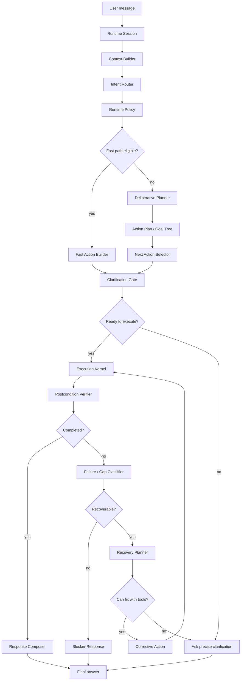
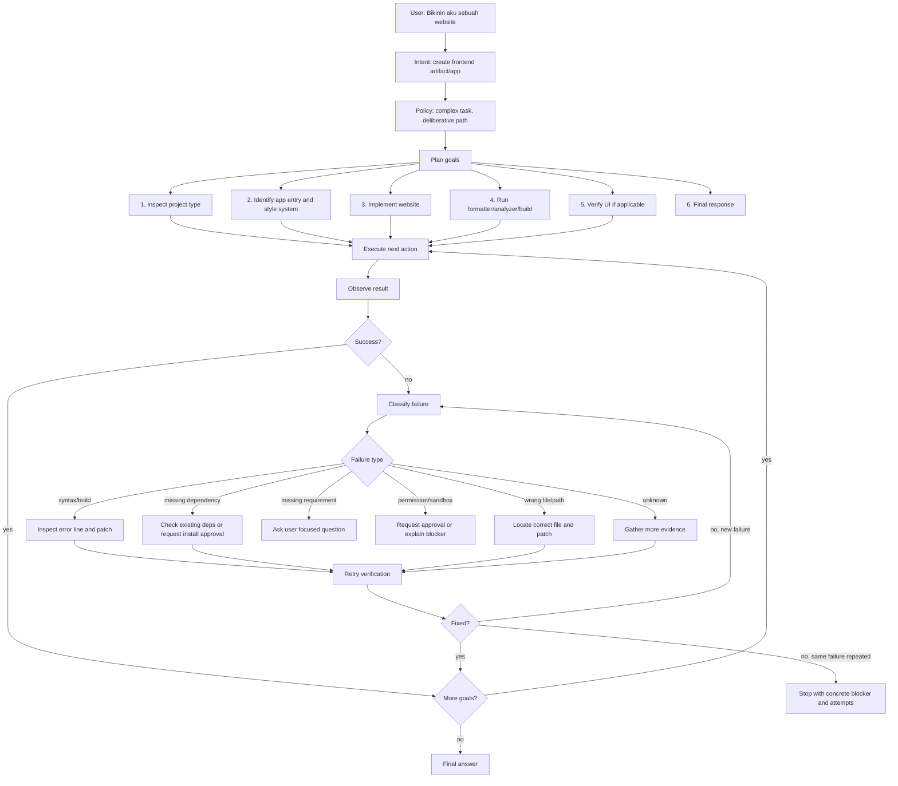
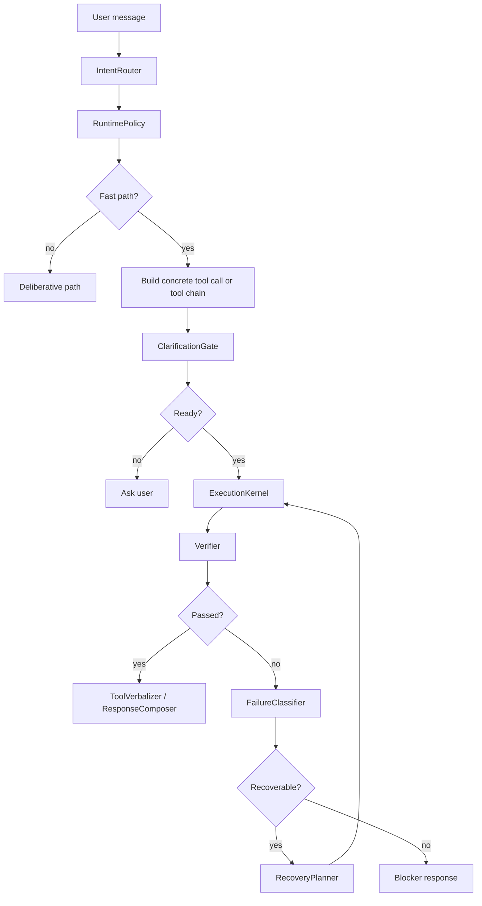
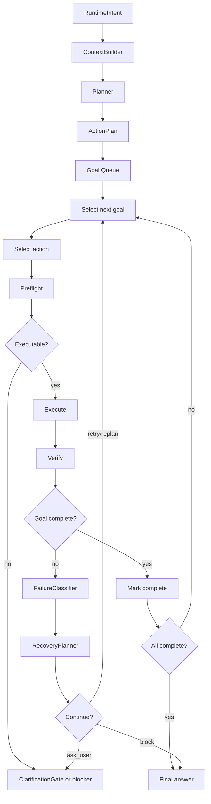
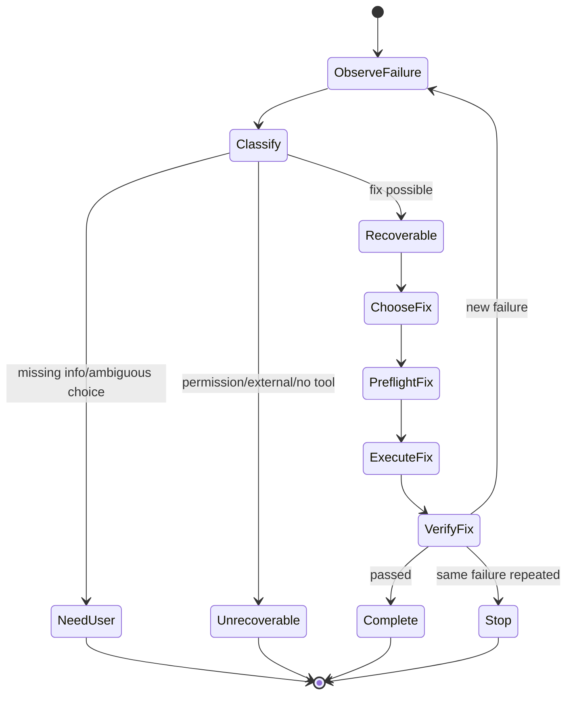
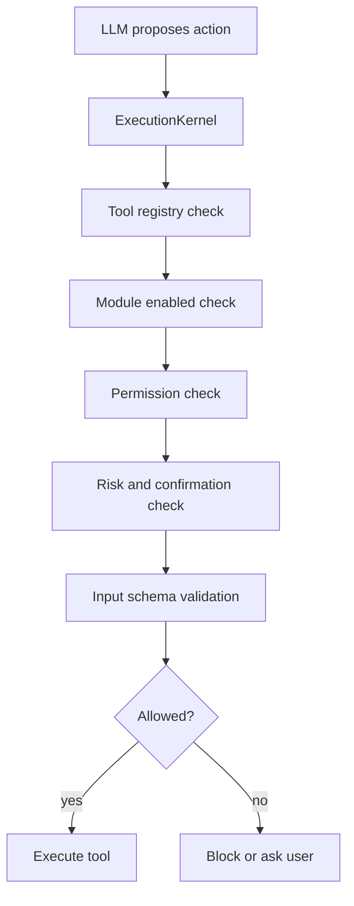

# Runtime Engine Upgrade V2

Status: Draft design for major runtime refactor

Target: Meow Agent Android-native agentic runtime

Primary goal: make the agent more reliable, secure, smooth, and genuinely agentic without turning the system into an unbounded retry loop.

## 1. Why This Upgrade Exists

Meow Agent is an Android-native agentic assistant. Unlike Linux-based agents such as OpenClaw or Hermes-style desktop agents, Meow runs inside Android constraints:

- app sandboxing
- permissions
- foreground/background limitations
- native MethodChannel boundaries
- Android intent behavior
- user confirmation requirements
- module toggles
- device state uncertainty

This means Meow cannot copy a Linux agent gateway directly. The useful thing to borrow is the runtime shape:

- one user request becomes one traceable runtime session
- the agent loops through plan, action, observation, verification
- tools are called through a controlled boundary
- failures are diagnosed instead of immediately ending the task
- every decision can be explained after the fact

The current Meow runtime already has many good guardrails, but too many decisions live inside prompts. Several prompts also overlap: analyzer, reflector, planner, selector, and reviewer can all decide ambiguity, retry, target resolution, completion, and user clarification. This creates redundant steps, conflicting decisions, and cases where a simple command takes too long.

V2 moves policy and safety out of prompt text and into deterministic runtime components.

## 2. Design Principles

### 2.1 Deterministic Kernel Owns Safety

The runtime kernel, not the LLM prompt, must own:

- permission checks
- confirmation checks
- module gating
- tool availability
- target resolution rules
- slot validation
- retry limits
- repeated-action detection
- postcondition verification
- destructive/sensitive action policy

LLM output can suggest actions, but the kernel decides whether an action may run.

### 2.2 LLM Is A Strategist, Not The Law

The LLM should be used for:

- interpreting user intent
- decomposing complex tasks
- selecting a reasonable strategy
- choosing among multiple valid recovery options
- summarizing results naturally

The LLM should not be the source of truth for:

- "is this tool allowed?"
- "does this tool need confirmation?"
- "does this app name need app.resolve first?"
- "is this target valid?"
- "has the task really completed?"

Those belong in code.

### 2.3 Fast When Simple, Deliberative When Needed

Simple requests should not pay the full cost of a complex agent loop.

Examples that should usually be fast path:

- "open whatsapp"
- "cek baterai"
- "list notes"
- "apa isi clipboard?"
- "buat note judul X isi Y"
- "buka url ini"

Examples that should use deliberative path:

- "bikinin aku sebuah website"
- "rapihin semua workflow yang error"
- "buat agent baru, kasih tools, lalu test"
- "update semua module yang targetnya X"
- destructive actions
- multi-target actions
- cross-agent work
- low-confidence target resolution

### 2.4 Agentic Recovery Must Be Bounded

The agent should not stop at the first failure when a fix is possible. But it also must not retry forever.

Every recovery attempt must answer:

- What failed?
- Why did it fail?
- Is this failure recoverable?
- Which tools can fix it?
- Is the next action materially different from the previous attempt?
- Has the same fix already failed?
- Should we ask the user instead?

### 2.5 Verification Is Mandatory For Claims

The runtime should not claim success just because a tool returned `success=true`.

For important actions, the runtime verifies:

- did the expected entity exist after create?
- did the expected entity disappear after delete?
- did the field actually change after update?
- did build/test/analyze pass after code changes?
- did the app/tool result include enough data to answer?

### 2.6 Prompts Must Be Small And Phase-Specific

Each prompt should have one job.

Bad prompt shape:

- analyzer also handles recovery
- planner also handles target validation
- reviewer also decides retry policy
- selector also decides clarification policy
- prompt contains specific tool chains and one-off patches

Good prompt shape:

- intent prompt: understand user request
- planning prompt: decompose complex work
- recovery prompt: choose a new strategy from classified failure data
- response prompt: produce user-facing answer

## 3. Target Runtime Overview



## 4. Complex Task Example: "Bikinin Aku Sebuah Website"

This is the expected agentic behavior for a complex build task.



This is the key behavior change: a failed build/test/tool call is not automatically the end. It becomes evidence for the next action.

## 5. Runtime Components

### 5.1 RuntimeSession

Owns one user request from start to final answer.

Responsibilities:

- session id
- agent id
- original user message
- normalized user intent
- runtime options
- event log
- token/latency counters
- loop counters
- recovery counters
- final outcome

The session must be append-only from the perspective of trace events.

### 5.2 RuntimeEvent

Every important decision should be recorded as an event.

Suggested fields:

```text
id
sessionId
timestamp
phase
eventType
source: deterministic | llm | tool | user
summary
data
latencyMs
tokenUsage
```

Important event types:

- session.started
- context.built
- intent.detected
- policy.decided
- clarification.needed
- plan.created
- action.selected
- preflight.passed
- preflight.blocked
- tool.called
- tool.completed
- verifier.passed
- verifier.failed
- recovery.classified
- recovery.planned
- recovery.attempted
- session.completed
- session.blocked

### 5.3 ContextBuilder

Builds stable context for the request.

Inputs:

- user message
- recent conversation
- agent profile
- enabled modules
- permissions
- tool registry
- ecosystem snapshot
- pending confirmation state

Rules:

- context is read-only
- context should be summarized for LLM prompts
- raw snapshot data should be available to deterministic resolvers
- do not hide module/permission blockers from the runtime

### 5.4 IntentRouter

Classifies the user request.

Output should be a compact deterministic object:

```text
RuntimeIntent
  kind
  confidence
  requestedOutcome
  candidateTools
  candidateTargets
  requiredSlots
  risk
  isQuestion
  isAction
  isMultiStep
  isMultiTarget
  needsUserVisibleResult
```

IntentRouter may use LLM, keyword catalog, or both. But its output is not final authority. RuntimePolicy validates it.

### 5.5 RuntimePolicy

Decides which path to use.

Output:

```text
RuntimePath
  type: fast | deliberative | clarify | block
  reason
  requiredChecks
  enabledTools
  maxSteps
  maxRecoveryAttempts
```

Fast path eligibility:

- high intent confidence
- single obvious tool or known deterministic tool chain
- required slots are present or resolvable
- no destructive action
- no multi-target action
- no cross-agent side effect
- no low-confidence target
- no complex composition

Deliberative path triggers:

- multi-step creation
- multi-target update/delete
- destructive/sensitive action
- workflow actions
- file/code generation with verification
- cross-agent operation
- low confidence
- missing target strategy
- previous failure requiring diagnosis

### 5.6 ClarificationGate

The single owner of user clarification before execution.

It checks:

- missing required slots
- ambiguous target
- low-confidence target match
- permission missing and cannot be requested in-app
- action requires user choice
- tool unavailable

Only this component should ask the user during preflight.

Selector, planner, reviewer, and recovery prompts should not independently ask questions unless the ClarificationGate has classified the gap as user-required.

### 5.7 ActionPlan

A concrete plan for the runtime.

```text
ActionPlan
  planId
  mainGoal
  completionCriteria
  goals[]
  constraints[]
  risk
  maxSteps
```

Each goal:

```text
Goal
  id
  title
  status: pending | running | complete | failed | skipped | blocked
  requiredSlots
  target
  candidateActions
  verification
  recoveryPolicy
```

V2 should avoid maintaining two competing plan shapes. Prefer one ActionPlan/Goal model and gradually remove legacy plan `steps` where possible.

### 5.8 NextActionSelector

Selects the next executable action from the plan.

For simple plans, this should be deterministic.

LLM selector is only needed when:

- multiple tools can satisfy the same goal
- tool choice depends on previous observations
- recovery has multiple possible strategies
- the plan is intentionally open-ended

### 5.9 ExecutionKernel

The only component allowed to call tools.

Responsibilities:

- enforce tool registry
- enforce confirmation
- enforce permission policy
- enforce module toggles
- validate input schema
- normalize tool args
- execute tool
- capture result
- prevent same-action infinite loops

The LLM never directly executes tools.

### 5.10 PostconditionVerifier

Determines whether the action actually accomplished the goal.

Verification types:

- result data check
- snapshot contains
- snapshot absent
- field equality
- build/analyze/test command success
- UI/browser verification
- file existence/content check
- user confirmation

Verifier output:

```text
VerificationResult
  passed
  confidence
  evidence
  missingEvidence
  failureClass
```

### 5.11 FailureClassifier

Classifies failure into a small taxonomy.

Suggested failure classes:

- missing_slot
- ambiguous_target
- permission_blocked
- module_disabled
- confirmation_required
- tool_unavailable
- invalid_args
- tool_failed
- transient_failure
- verification_failed
- no_result
- model_bad_json
- strategy_failed
- external_blocker
- unknown

The classifier should prefer deterministic rules. Use LLM only for ambiguous failure interpretation.

### 5.12 RecoveryPlanner

Chooses the next corrective action.

Rules:

- do not repeat the same tool and same args after the same failure
- prefer cheaper evidence gathering before risky changes
- retry only when args or strategy materially changes
- ask the user only when the missing information cannot be inferred or resolved
- stop when the same failure repeats past limit
- stop when no available tool can address the cause

Recovery output:

```text
RecoveryDecision
  action: retry | replan | ask_user | block | final_with_partial
  reason
  nextAction
  changedStrategy
```

### 5.13 ResponseComposer

Produces the final user-facing response.

It should receive:

- original user request
- completed goals
- failed/skipped goals
- verification evidence
- blocker if any
- concise trace summary

It should not invent success. If verification failed, the response must say so clearly.

## 6. Fast Path Design

Fast path is for direct, high-confidence tasks.



Fast path should usually skip:

- reflector
- full planner
- LLM selector
- LLM reviewer

Fast path may still use:

- deterministic target resolver
- confirmation gate
- postcondition verifier
- recovery classifier
- response composer

Examples:

```text
open whatsapp
  intent: open app
  chain: app.resolve -> app.open
  confirm: app.open if policy requires
  verify: tool result

cek baterai
  intent: system info
  tool: device.battery
  verify: result contains battery fields

buat note judul "A" isi "B"
  intent: create note
  tool: notes.create
  verify: snapshot/result contains created note
```

## 7. Deliberative Path Design

Deliberative path is for complex work.



Planner prompt should only create high-level goals and completion criteria. It should not encode low-level tool safety policy.

Good planner output:

```text
Goal 1: inspect current app structure
Goal 2: implement requested website in existing frontend entry
Goal 3: run formatter/analyzer/build
Goal 4: verify UI renders correctly
Goal 5: summarize result
```

Bad planner output:

```text
Call app.resolve first because app.open requires package
Retry exactly once if available list is non-empty
Ask user if any module fails
```

Those rules belong in runtime/tool metadata.

## 8. Recovery Loop

The recovery loop is what makes the runtime agentic.

### 8.1 Recovery State Machine



### 8.2 Recovery Limits

Suggested defaults:

```text
maxRecoveryAttemptsPerGoal: 2
maxTotalRecoveryAttempts: 5
maxSameFailureRepeats: 2
maxSameToolSameArgs: 1
```

Complex build/code tasks may increase total recovery attempts, but only if each attempt changes strategy.

### 8.3 Recovery Examples

Build error:

```text
tool: run analyzer/build
failure: syntax error at file:line
classification: verification_failed
recovery: inspect file, patch syntax, rerun analyzer/build
```

Missing dependency:

```text
failure: package not found
classification: external_blocker or missing_dependency
recovery:
  - check if dependency already exists
  - if install requires network/approval, request approval
  - if no approval, explain blocker
```

Ambiguous target:

```text
failure: two matching agents
classification: ambiguous_target
recovery: ask user to choose one
```

Tool unavailable:

```text
failure: no tool can perform requested action
classification: tool_unavailable
recovery: explain limitation and offer closest available path
```

## 9. Tool Metadata Upgrade

Move specific prompt rules into tool metadata.

Suggested fields:

```text
ToolDefinition
  name
  description
  inputSchema
  risk
  requiresConfirmation
  moduleRequired
  permissionRequired
  requiredSlots
  targetPolicy
  preconditions
  postconditions
  answerPolicy
  recoveryHints
```

### 9.1 Target Policy

Examples:

```text
targetPolicy:
  type: none | exact_id | fuzzy_name | package_name | file_path | agent_id
  resolver: app.resolve | agents.resolve | files.resolve
  minConfidence: 0.85
  ambiguity: ask_user
```

### 9.2 Preconditions

Examples:

```text
app.open:
  preconditions:
    - package must be exact package name
    - package must exist on device
  resolverChain:
    - app.resolve

notes.update:
  preconditions:
    - note id must exist
```

### 9.3 Postconditions

Examples:

```text
notes.create:
  postcondition:
    type: snapshot_contains
    entity: note
    match: id

system.agents.delete:
  postcondition:
    type: snapshot_absent
    entity: agent
    match: id
```

### 9.4 Answer Policy

Examples:

```text
device.battery:
  answerPolicy: result_is_answer

notes.search:
  answerPolicy: zero_results_is_answer

files.search:
  answerPolicy: summarize_results
```

This prevents reviewer prompts from treating valid empty results as failure.

## 10. Prompt Constants Cleanup

### 10.1 Current Problem

The prompt constants have grown into a rule pile. They contain:

- global identity behavior
- ambiguity policy
- tool chaining instructions
- target resolution instructions
- planner structure
- selector retry policy
- reviewer empty-result policy
- module/permission failure policy
- one-off examples for specific tools

This makes prompts:

- long
- repetitive
- harder to test
- easier to conflict
- expensive in tokens
- prone to over-planning simple tasks

### 10.2 New Prompt Boundaries

V2 should split prompts into minimal phase prompts.

```text
Prompt: Intent Understanding
Purpose:
  Convert user message + small context into RuntimeIntent.
Should not:
  create full plan
  decide final tool args
  decide retry policy
  enforce permission policy

Prompt: Complex Planning
Purpose:
  Create ActionPlan goals for deliberative tasks.
Should not:
  include tool-specific safety rules
  ask user directly
  verify completion

Prompt: Recovery Strategy
Purpose:
  Given classified failure and available tools, choose a new strategy.
Should not:
  retry same action blindly
  override runtime limits
  bypass confirmation/permission

Prompt: Response Composition
Purpose:
  Write concise final answer from verified runtime facts.
Should not:
  invent success
  mention internal tool names unless debug/dev mode requires it
```

### 10.3 Rules To Move Out Of Prompt

Move these from prompt constants into code/config:

- app.open must use app.resolve first
- exact id/name resolution requirements
- zero-result-is-answer behavior
- retry count limits
- same tool/same args loop detection
- confirmation requirements
- permission/module blockers
- post-execute verification
- bulk selector fan-out
- destructive action handling
- fallback to available entity list

### 10.4 Rules That Can Stay In Prompt

Keep only language/strategy behavior:

- understand the user's natural language
- preserve user's language in clarification/final answer
- decompose genuinely complex tasks
- choose among multiple reasonable strategies
- explain verified results clearly
- be honest about blockers

### 10.5 Prompt Size Target

Target sizes:

```text
intent prompt: small
planner prompt: medium
recovery prompt: small to medium
response prompt: small
```

Avoid embedding the whole tool catalog in every phase. Use filtered tools from ToolCatalog/RuntimePolicy.

## 11. Security Model

Security remains runtime-owned.



Never rely on prompt text to prevent unsafe actions.

## 12. Android-Native Capability Graph

Meow should maintain an Android capability graph:

```text
Capability
  id
  module
  tools
  requiredAndroidPermission
  canRequestInApp
  requiresSettingsRedirect
  risk
  currentState
```

This lets the runtime know:

- what is currently possible
- what needs user permission
- what needs settings redirect
- what cannot be done
- which tool should be considered

The agent should plan within available capabilities first, then ask only when a missing capability blocks the task.

## 13. Completion Semantics

The runtime should distinguish:

```text
done
  all required goals verified

partial
  some goals completed, some blocked/skipped

blocked
  cannot continue without user/external change

failed
  tried allowed recovery paths and verification still failed
```

Final response should reflect the actual state.

Examples:

```text
Done:
  "Website-nya sudah aku buat dan build check sudah lolos."

Partial:
  "UI sudah aku implementasikan, tapi build belum bisa diverifikasi karena dependency X belum tersedia."

Blocked:
  "Aku perlu izin akses notifikasi dulu sebelum bisa lanjut."

Failed:
  "Aku sudah coba dua strategi perbaikan, tapi error yang sama masih muncul di file X. Ini blocker-nya..."
```

## 14. Migration Plan

### Phase 1: Runtime Trace And Measurement

Goal: make runtime behavior visible.

Tasks:

- add structured runtime events per session
- record phase, decision, reason, latency, token usage, tool call, verifier result
- expose last-session trace in debug mode
- measure step count per user request
- measure LLM call count per user request

Acceptance criteria:

- a dev can inspect why a request used fast or deliberative path
- repeated/redundant LLM phases are visible
- failure recovery attempts are visible

### Phase 2: RuntimePolicy And Fast Path

Goal: stop over-deliberating simple commands.

Tasks:

- create RuntimePolicy
- define fast path eligibility
- implement fast path action builder for common actions
- skip reflector/planner/reviewer for eligible commands
- preserve confirmation and verification

Acceptance criteria:

- simple read-only/system commands complete with fewer phases
- app open flow is deterministic
- no loss of security checks

### Phase 3: Single ClarificationGate

Goal: remove duplicate ask-user decisions.

Tasks:

- create ClarificationGate
- move missing slot and ambiguous target logic into it
- prevent planner/selector/reviewer from directly asking unless gate marks user-required
- standardize clarification response format

Acceptance criteria:

- ambiguous requests ask once, early
- selector/reviewer do not produce surprise late clarification for known preflight gaps

### Phase 4: Tool Metadata Upgrade

Goal: move prompt patches into tool definitions.

Tasks:

- add requiredSlots
- add targetPolicy
- add preconditions
- add postconditions
- add answerPolicy
- add recoveryHints where useful

Acceptance criteria:

- prompt no longer needs app.resolve/app.open instruction
- zero-result behavior is tool-owned
- verification can be configured per tool

### Phase 5: RecoveryClassifier And RecoveryPlanner

Goal: make failures agentic instead of terminal.

Tasks:

- classify failure types
- create bounded recovery policy
- detect repeated same tool/same args/same failure
- allow recovery actions when tools can fix the issue
- ask user only when runtime cannot infer/resolve the gap

Acceptance criteria:

- build/test/tool failures can trigger a new corrective attempt
- repeated identical failures stop cleanly
- final response includes real blocker when blocked

### Phase 6: ActionPlan Unification

Goal: remove competing plan/goal representations.

Tasks:

- define canonical ActionPlan/Goal model
- migrate planner output to ActionPlan
- make goal tree derived from ActionPlan or replace it
- remove legacy plan step assumptions where possible

Acceptance criteria:

- runtime has one source of truth for completion
- planner and reflector do not compete
- selector operates on canonical next actionable goal

### Phase 7: Prompt Constants Rewrite

Goal: clean, accurate, smaller prompts.

Tasks:

- split prompt constants by phase
- delete tool-specific policy from prompts
- keep only language/strategy instructions
- create prompt tests for common cases
- compare old vs new on regression set

Acceptance criteria:

- prompts are shorter
- fewer conflicts
- same or better accuracy
- simpler maintenance

## 15. Regression Test Matrix

### Simple Fast Path

```text
open whatsapp
cek baterai
apa isi clipboard?
list notes
buat note judul X isi Y
```

Expected:

- no full planner unless needed
- no reflector unless risk/ambiguity requires it
- deterministic verification

### Ambiguity

```text
buka toko
hapus agent itu
update workflow yang kemarin
```

Expected:

- ask a precise clarification
- do not guess destructive targets
- do not ask repeatedly

### Complex Build

```text
bikinin aku sebuah website
buat module baru dan test
rapihin workflow ini sampai jalan
```

Expected:

- create plan
- execute multiple goals
- verify after changes
- recover from build/test errors when possible

### Failure Recovery

```text
tool returns invalid args
tool result success=false with available alternatives
build fails with syntax error
permission missing
module disabled
```

Expected:

- classify failure
- retry only with changed strategy
- ask user only when required
- stop with blocker after bounded attempts

### Completion Honesty

```text
search returns zero rows
create succeeds but verification fails
delete returns success but entity still exists
```

Expected:

- zero result can be valid answer
- unverified create/delete is not claimed as success
- final response reflects done/partial/blocked/failed

## 16. Suggested Implementation Order

Recommended order:

1. Add trace events and runtime metrics.
2. Introduce RuntimePolicy with fast path decision only.
3. Add fast path for a tiny set of safe commands.
4. Centralize ClarificationGate.
5. Add failure taxonomy.
6. Add bounded recovery loop.
7. Move tool-specific prompt rules into ToolDefinition metadata.
8. Unify ActionPlan/GoalTree.
9. Rewrite prompt constants.
10. Expand fast path coverage.

Do not rewrite prompts first. Without trace and policy, prompt cleanup will be hard to validate.

## 17. Success Metrics

Runtime quality should improve in measurable ways:

```text
simple command average LLM calls: down
simple command average steps: down
complex task first-failure stop rate: down
successful recovery rate: up
duplicate clarification rate: down
same tool/same args repeat rate: down
unverified success claims: down
prompt size/token usage: down
```

## 18. Final Target

Meow Runtime V2 should feel like this:

- simple commands are immediate
- complex tasks are thoughtful
- failures become diagnosis, not instant defeat
- safety is enforced by code
- prompts are smaller and clearer
- recovery is bounded and explainable
- final answers are based on verified facts

The agent should not be reckless, but it should be persistent.

